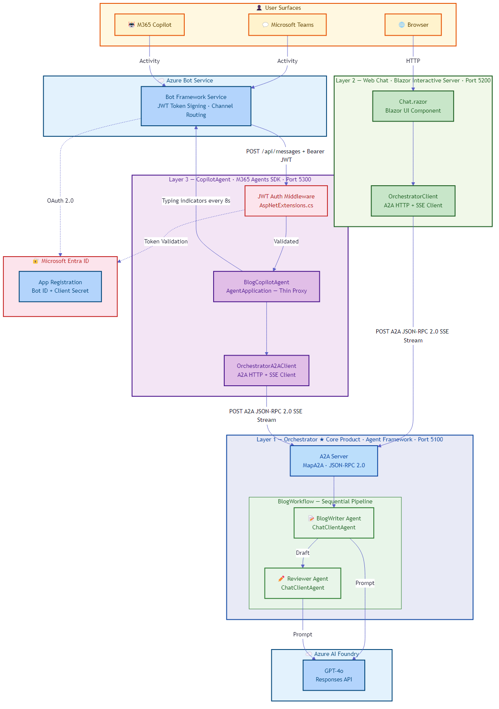
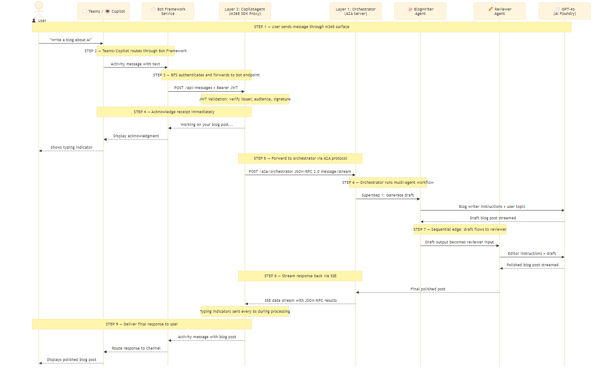

# SKCopilot-v2 — Architecture & Message Flow

> A Custom Engine Agent (CEA) that surfaces an AI Agent Framework orchestrator in Microsoft 365 Copilot and Microsoft Teams.

---

## System Architecture



### High-Level Components

| Layer | Component | Framework | Purpose |
|-------|-----------|-----------|---------|
| **Layer 1** | Orchestrator | Microsoft Agent Framework | Core AI — multi-agent workflow (BlogWriter → Reviewer) via A2A protocol |
| **Layer 2** | Web Chat | Blazor Interactive Server | Browser-based chat UI — calls orchestrator directly, no M365 dependency |
| **Layer 3** | CopilotAgent | M365 Agents SDK | Thin proxy — receives Activities from Copilot/Teams, forwards to orchestrator via A2A |
| **Cloud** | Azure Bot Service | Bot Framework | Channel routing, JWT token signing, message relay between M365 surfaces and the bot endpoint |
| **Cloud** | Azure AI Foundry | GPT-4o | LLM inference for both BlogWriter and Reviewer agents |
| **Identity** | Microsoft Entra ID | OAuth 2.0 / OIDC | App registration, token validation, tenant-scoped authentication |

---

## Message Flow — End to End



### Step-by-Step Walkthrough

1. **User sends a message** — The user types a prompt (e.g., "Write a blog about AI") in Microsoft Teams or M365 Copilot chat.

2. **M365 surface routes to Bot Framework Service** — Teams/Copilot wraps the message in a Bot Framework **Activity** and sends it to Azure Bot Service (BFS). The bot channel registration determines which endpoint receives the traffic.

3. **BFS authenticates and forwards to the bot endpoint** — BFS obtains a JWT from Entra ID, signs the request, and POSTs the Activity to `https://<bot-domain>/api/messages` with a `Bearer` token. This is the only way M365 traffic reaches your code.

4. **CopilotAgent validates the JWT** — The `AspNetExtensions.cs` middleware validates the token's issuer, audience (your App ID), and signing keys against Entra ID and BFS OpenID metadata. If validation fails, the request is rejected with 401/403. On success, the Activity reaches `BlogCopilotAgent`.

5. **Immediate acknowledgment** — The agent sends a typing indicator and "Working on your blog post..." message back through BFS to the user. This prevents the M365 surface from timing out during the multi-minute AI workflow.

6. **Forward to Orchestrator via A2A** — `BlogCopilotAgent` calls the Layer 1 orchestrator at `POST /a2a/orchestrator` using the A2A (Agent-to-Agent) JSON-RPC 2.0 protocol with SSE streaming. The agent is a **thin proxy** — no LLM calls, no business logic.

7. **Orchestrator runs the multi-agent workflow** — The Agent Framework `BlogWorkflow` executes a sequential pipeline:
   - **BlogWriter** agent sends the topic + writing instructions to GPT-4o → receives a draft
   - **Reviewer** agent receives the draft + editorial instructions → sends to GPT-4o → receives a polished post

8. **Response streams back via SSE** — The orchestrator streams JSON-RPC results back to the CopilotAgent over the SSE connection. During processing, the CopilotAgent sends typing indicators every ~8 seconds to keep the Teams connection alive.

9. **Final response delivered to user** — The CopilotAgent sends the polished blog post as an Activity message back through BFS → Teams/Copilot → displayed to the user.

---

## Why This Architecture Is Required

### The Core Problem

The **Microsoft Agent Framework** (the successor to Semantic Kernel + AutoGen) is designed for building AI agents and multi-agent workflows. It exposes agents via the **A2A (Agent-to-Agent) protocol** — an open, HTTP-based JSON-RPC 2.0 standard for agent interoperability.

However, **M365 Copilot and Microsoft Teams do not speak A2A**. They speak the **Bot Framework Activity protocol** — a different messaging contract that routes through Azure Bot Service with JWT-authenticated HTTP POSTs.

This creates a protocol gap:

```
Agent Framework (A2A protocol)  ←→  ??? ←→  M365 Copilot (Activity protocol)
```

### The Solution: Custom Engine Agent as a Protocol Bridge

The **M365 Agents SDK** provides the `AgentApplication` base class and `MapAgentEndpoints()` to handle the Activity protocol. By building a **Custom Engine Agent (CEA)** as a thin proxy, you bridge the two worlds:

```
Agent Framework (A2A)  ←→  CopilotAgent (CEA)  ←→  Azure Bot Service  ←→  M365 Copilot
```

This is not optional — it is the **only supported path** to surface Agent Framework agents in M365 surfaces today.

### Why Each Piece Is Required

| Component | Why Required |
|-----------|-------------|
| **Azure Bot Registration** | M365 requires a registered bot identity. BFS handles channel routing, token signing, and message relay. Without it, Teams/Copilot have no endpoint to send messages to. |
| **Entra ID App Registration** | The bot needs an identity (App ID + secret) for OAuth 2.0. BFS uses this to sign JWTs. The CEA uses it to validate inbound tokens. Single-tenant or multi-tenant — must match. |
| **Teams App Manifest** | The manifest (`manifest.json`) declares the bot to M365 — its ID, name, scopes, and the `copilotAgents.customEngineAgents` section that enables it in Copilot chat. Without a valid, installed manifest, the bot doesn't appear in Teams or Copilot. |
| **JWT Authentication Middleware** | BFS probes the endpoint with token validation before routing real traffic. If your endpoint doesn't validate JWTs correctly (right audience, right issuers), BFS silently drops all messages. Zero traffic arrives. |
| **CopilotAgent (Thin Proxy)** | Translates between Activity protocol (inbound from BFS) and A2A protocol (outbound to orchestrator). Handles typing indicators, acknowledgments, and connection keepalive during long-running workflows. |
| **A2A Protocol Layer** | The orchestrator exposes `MapA2A()` for standardized agent-to-agent communication. Both Layer 2 (WebChat) and Layer 3 (CopilotAgent) consume the same A2A endpoint — the orchestrator doesn't need to know which client is calling. |
| **Multi-Agent Workflow** | The Agent Framework `BlogWorkflow` pipelines multiple agents sequentially. This is where the AI intelligence lives — completely decoupled from the M365 channel layer. |

### Key Design Decisions

1. **Separation of concerns** — AI logic (Agent Framework) is completely separated from channel connectivity (M365 Agents SDK). The orchestrator is independently deployable and testable without any M365 dependency.

2. **Protocol bridge, not monolith** — The CEA contains zero business logic. It's a thin adapter between two protocol worlds. This means you can swap the orchestrator, add agents, or change the workflow without touching the M365 layer.

3. **Two independent clients** — Both the Blazor WebChat and the CopilotAgent call the same A2A endpoint. This proves the orchestrator is channel-agnostic — any A2A client can use it.

4. **Typing indicators for long workflows** — Multi-agent workflows can take 30-90 seconds. Without periodic typing indicators, Teams/Copilot will time out the connection. The CEA sends typing activities every ~8 seconds during processing.

---

## Deployment Topology

```
Azure App Service (or Container)          Azure Bot Service          M365 Admin
┌──────────────────────────┐     ┌──────────────────────┐    ┌─────────────────┐
│ Orchestrator  (Port 5100)│     │ Bot Registration      │    │ Teams App        │
│   └─ /a2a/orchestrator   │     │   └─ Messaging endpoint│   │   └─ manifest.zip│
│                          │     │   └─ Teams channel     │    │   └─ Sideloaded  │
│ CopilotAgent  (Port 5300)│◄────│   └─ JWT signing      │    │     or published │
│   └─ /api/messages       │     └──────────────────────┘    └─────────────────┘
│                          │              ▲                          ▲
│ WebChat       (Port 5200)│              │                          │
│   └─ Blazor UI           │         Entra ID                  Admin Center
└──────────────────────────┘     (App Registration)         (App Catalog)
```

### Critical Configuration Checklist

- [ ] **App Registration** — `signInAudience` must match Azure Bot type (SingleTenant vs MultiTenant)
- [ ] **Azure Bot** — Messaging endpoint set to `https://<domain>/api/messages`
- [ ] **Teams Channel** — Enabled on the Azure Bot resource, terms accepted
- [ ] **TokenValidation** — `Audiences` includes your App ID, `TenantId` set for single-tenant
- [ ] **Manifest** — `${{BOT_ID}}` and `${{BOT_DOMAIN}}` replaced with real values, version bumped
- [ ] **App Install** — Manifest ZIP sideloaded or published to Teams Admin Center

---

## Solution Structure

The solution is a .NET 8 multi-project workspace organized into three deployable layers, a shared test suite, operational scripts, and documentation. Each project is independently deployable and communicates over HTTP using the A2A protocol.

```
SKCopilot-v2/
├── SKCopilot-v2.sln                # Visual Studio solution — binds all projects
├── ARCHITECTURE.md                 # High-level architecture proposal
├── DEPLOYMENT_QUICKSTART.md        # Quick-start deployment guide
│
├── src/
│   ├── Orchestrator/               # Layer 1 — AI Agent Framework orchestrator
│   ├── WebChat/                    # Layer 2 — Blazor Interactive Server chat UI
│   └── CopilotAgent/              # Layer 3 — M365 Custom Engine Agent (CEA)
│
├── tests/
│   ├── Orchestrator.Tests/         # Unit tests for Layer 1
│   ├── WebChat.Tests/              # Unit tests for Layer 2
│   ├── CopilotAgent.Tests/         # Unit tests for Layer 3
│   └── Integration.Tests/          # Cross-layer integration tests
│
├── scripts/                        # Operational automation
│   ├── register-bot.ps1            # Azure Bot + Entra ID provisioning
│   ├── package-teams-app.ps1       # Teams app ZIP builder
│   └── diagnose-teams.ps1          # Connectivity diagnostic tool
│
├── docs/                           # Architecture documentation
│   ├── Architecture-and-Flow.md    # This document
│   ├── cea-deployment-checklist.md  # Deployment readiness checklist
│   └── diagrams/                   # Rendered architecture and flow diagrams
```

---

### Layer 1 — Orchestrator (`src/Orchestrator/`)

The Orchestrator is the AI brain of the solution. It hosts the multi-agent workflow using the **Microsoft Agent Framework** and exposes it over the **A2A (Agent-to-Agent) protocol**. It has no knowledge of Teams, Copilot, or the Bot Framework — it is a pure AI service that any A2A-compatible client can call.

| File | Purpose |
|------|---------|
| **`Program.cs`** | Application entry point. Creates the Azure AI Foundry project client using `DefaultAzureCredential` (no API keys), obtains an `IChatClient` for GPT-4o via the Foundry Responses pattern, builds the multi-agent workflow, registers it with DI, and maps the A2A endpoint at `/a2a/orchestrator`. Also maps a health check at `/`. |
| **`Agents/BlogWriterSetup.cs`** | Factory for the **BlogWriter** agent — a `ChatClientAgent` with detailed system instructions for producing well-structured, ~800-word blog posts in Markdown. Defines the writing style, structure (title → intro → body → conclusion), and formatting rules. The agent is single-purpose: topic in, blog draft out. |
| **`Agents/ReviewerSetup.cs`** | Factory for the **Reviewer** agent — a `ChatClientAgent` that acts as a senior content editor. Evaluates the draft against structure, quality, and accuracy criteria. Outputs either the original post (if it passes) or a revised version (if it doesn't) — never outputs review commentary, only the final post. |
| **`Workflows/BlogWorkflow.cs`** | Composes the two agents into a **sequential pipeline** using `WorkflowBuilder`. BlogWriter receives the user's topic and produces a draft, then Reviewer receives that draft and produces the final polished post. Returns both the entry agent and the built workflow for DI registration. |
| **`Orchestrator.csproj`** | Project file targeting .NET 8. Key packages: `Azure.AI.Projects` (Foundry client), `Azure.Identity` (DefaultAzureCredential), `Microsoft.Agents.AI.Foundry` (Foundry integration), `Microsoft.Agents.AI.Hosting.A2A.AspNetCore` (A2A endpoint hosting), `Microsoft.Agents.AI.Workflows` (workflow builder). |
| **`appsettings.json`** | Configuration with `Foundry:Endpoint` (AI Foundry project URL) and `Foundry:Model` (defaults to `gpt-4o`). Placeholder values — real values set in Azure App Settings or user secrets. |
| **`appsettings.Development.json`** | Development overrides. Sets Kestrel to listen on `http://localhost:5100`. |
| **`Properties/launchSettings.json`** | Visual Studio / `dotnet run` launch profiles with local port and environment configuration. |

**Why this layer exists:** The Agent Framework provides the multi-agent orchestration (workflow graphs, agent handoffs, LLM integration) but speaks A2A protocol — not the Bot Framework Activity protocol that M365 requires. Separating AI logic here means the orchestrator is independently deployable, testable, and reusable by any client.

---

### Layer 2 — WebChat (`src/WebChat/`)

The WebChat is a **Blazor Interactive Server** web application that provides a browser-based chat UI. It calls the same A2A endpoint as the CopilotAgent, proving the orchestrator is channel-agnostic. This layer has zero M365 dependencies.

| File | Purpose |
|------|---------|
| **`Program.cs`** | Application entry point. Configures Razor components with interactive server rendering, registers `OrchestratorClient` as a typed `HttpClient` pointing at the orchestrator's base URL (`http://localhost:5100` by default), and maps Razor component routes. |
| **`Services/OrchestratorClient.cs`** | A2A HTTP client that sends JSON-RPC 2.0 requests to the orchestrator. Supports both streaming (`message/stream` with SSE parsing) and non-streaming (`message/send`) methods — tries streaming first, falls back on failure. Handles JSON-RPC envelope construction, SSE event parsing, and text extraction from A2A response parts. |
| **`Components/App.razor`** | Root HTML shell — defines the `<html>`, `<head>`, `<body>` structure, includes Bootstrap CSS, component-scoped styles (`WebChat.styles.css`), and the Blazor Web JS runtime (`blazor.web.js`). |
| **`Components/Routes.razor`** | Blazor router component — maps URL paths to page components. |
| **`Components/_Imports.razor`** | Global using directives for all Razor components — imports ASP.NET Core, Blazor, and project namespaces. |
| **`Components/Pages/Chat.razor`** | The main chat page (mapped to `/`). Renders a message history, input field, and send button. On submit, calls `OrchestratorClient.GenerateBlogAsync()`, displays a loading spinner during generation, and renders the response with basic Markdown-to-HTML formatting. Handles errors (orchestrator unreachable, timeout, unexpected exceptions) with user-facing alerts. |
| **`Components/Pages/Home.razor`** | Default Blazor template home page. |
| **`Components/Pages/Counter.razor`** | Default Blazor template counter demo page. |
| **`Components/Pages/Weather.razor`** | Default Blazor template weather data page. |
| **`Components/Pages/Error.razor`** | Error boundary page for unhandled exceptions. |
| **`Components/Pages/Chat.razor.css`** | Scoped CSS for the chat UI — styles the chat container, message bubbles, input area, and loading state. |
| **`Components/Layout/MainLayout.razor`** | Application layout shell — defines the sidebar navigation and main content area. |
| **`Components/Layout/MainLayout.razor.css`** | Scoped CSS for the main layout. |
| **`Components/Layout/NavMenu.razor`** | Navigation menu component — links to Home, Chat, Counter, and Weather pages. |
| **`Components/Layout/NavMenu.razor.css`** | Scoped CSS for the navigation menu. |
| **`WebChat.csproj`** | Project file targeting .NET 8. Minimal dependencies: only `Microsoft.Extensions.Http` for typed `HttpClient` support. No Agent SDK or AI packages — this layer is a pure web UI. |
| **`appsettings.json`** | Configuration with `Orchestrator:BaseUrl` and `Orchestrator:A2APath` pointing to the Layer 1 A2A endpoint. |
| **`appsettings.Development.json`** | Development overrides (logging levels). |
| **`wwwroot/app.css`** | Global application styles. |
| **`wwwroot/favicon.png`** | Browser tab icon. |
| **`wwwroot/bootstrap/`** | Local Bootstrap CSS distribution for offline/fast loading. |
| **`Properties/launchSettings.json`** | Visual Studio / `dotnet run` launch profiles. |

**Why this layer exists:** Provides an immediate, no-M365-required way to test the orchestrator. Also demonstrates that the A2A protocol is truly channel-agnostic — the same orchestrator serves both a web UI and M365 Copilot without modification.

---

### Layer 3 — CopilotAgent (`src/CopilotAgent/`)

The CopilotAgent is the **Custom Engine Agent (CEA)** — the protocol bridge between M365 (Bot Framework Activity protocol) and the orchestrator (A2A protocol). It is the only layer that touches the M365 Agents SDK and Bot Framework authentication. It contains zero business logic and zero LLM calls.

| File | Purpose |
|------|---------|
| **`Program.cs`** | Application entry point and the most critical file for M365 connectivity. Registers the M365 Agents SDK (`AddAgent<BlogCopilotAgent>`), configures JWT Bearer authentication for Bot Framework Service tokens (`AddAgentAspNetAuthentication`), registers the A2A client, adds request-tracing middleware that logs every inbound request (method, path, remote IP, auth header), maps diagnostic endpoints (`GET /` for health, `GET /api/messages` for reachability, `POST /api/ping` for no-auth traffic testing), and maps the SDK endpoint (`MapAgentEndpoints`) with auth enforcement in production. |
| **`BlogCopilotAgent.cs`** | The thin proxy agent. Extends `AgentApplication` from the M365 Agents SDK. Registers handlers for `MembersAdded` (sends a welcome message) and `Message` activities. On message: sends an immediate acknowledgment ("Working on your blog post..."), fires a typing indicator, calls `OrchestratorA2AClient.GenerateBlogAsync()` with a progress callback that sends typing indicators every ~8 seconds to prevent M365 timeout, then sends the final blog post back to the user. |
| **`AspNetExtensions.cs`** | JWT Bearer authentication configuration adapted from the official M365 Agents SDK sample. Reads `TokenValidation` config section (Audiences, TenantId, ValidIssuers). Configures ASP.NET `JwtBearer` with issuer validation, audience validation, signing key validation, and AAD-specific issuer key validation. Dynamically switches OpenID metadata endpoints based on whether the inbound token is from Bot Framework Service (BFS) or Entra ID. Logs auth success (🟢), forbidden (🟡), and failure (🔴) events for debugging. |
| **`Services/OrchestratorA2AClient.cs`** | A2A HTTP client (identical in shape to Layer 2's `OrchestratorClient` but with an added `progressCallback` parameter). Sends JSON-RPC 2.0 requests to the orchestrator, tries streaming first (SSE), falls back to non-streaming. During streaming, calls the progress callback every 8 seconds — this is what drives the typing indicators that keep the Teams connection alive during long-running AI generation. |
| **`CopilotAgent.csproj`** | Project file targeting .NET 8. Key packages: `Microsoft.Agents.Hosting.AspNetCore` (M365 Agents SDK hosting), `Microsoft.Agents.Authentication.Msal` (MSAL-based auth for outbound BFS calls), `Microsoft.AspNetCore.Authentication.JwtBearer` (inbound JWT validation), `Microsoft.IdentityModel.Validators` (AAD signing key validation). |
| **`appsettings.json`** | Production configuration structure with placeholder values. Sections: `TokenValidation` (Audiences including the App ID + BFS URL, TenantId), `Orchestrator` (BaseUrl, A2APath), `Connections` (BotServiceConnection with MSAL auth — ClientId, ClientSecret, AuthorityEndpoint, TenantId, Scopes). Real values stored in Azure App Settings, never in source. |
| **`appsettings.Development.json`** | Development overrides (logging levels). Auth is disabled in development via `requireAuth: !app.Environment.IsDevelopment()`. |
| **`Properties/launchSettings.json`** | Visual Studio / `dotnet run` launch profiles. |

**Why this layer exists:** This is the **only supported path** to surface Agent Framework agents in Teams and M365 Copilot. The CEA receives Bot Framework Activities from Azure Bot Service, translates them to A2A JSON-RPC calls, and sends responses back. Without it, there is no way for M365 to communicate with the orchestrator.

---

### Teams App Package (`src/CopilotAgent/appPackage/`)

The app package is the deployment artifact that declares the bot to Microsoft 365. It must be sideloaded or published to the Teams admin catalog before the bot appears in Teams or Copilot.

| File | Purpose |
|------|---------|
| **`manifest.json`** | Teams app manifest (v1.21 schema). Declares the bot identity (`${{BOT_ID}}`), display name, description, icon references, bot scopes (`copilot`, `personal`, `team`, `groupChat`), valid domains, command lists (`write`, `help`), and the critical `copilotAgents.customEngineAgents` section that registers this bot as a Custom Engine Agent in M365 Copilot. Uses `${{BOT_ID}}` and `${{BOT_DOMAIN}}` placeholders — replaced at build time by `package-teams-app.ps1`. |
| **`color.png`** | 192×192 pixel color icon displayed in the Teams app store and chat header. |
| **`outline.png`** | 32×32 pixel outline icon displayed in the Teams compose bar and app tray. |
| **`generate-icons.ps1`** | PowerShell script that generates placeholder PNG icons if the real ones are missing. Used by the packaging script as a fallback. |
| **`SKCopilotV2.zip`** | The built app package (manifest + icons in a ZIP). This is the file you sideload into Teams or upload to the admin catalog. Created by `scripts/package-teams-app.ps1`. |
| **`env/.env.dev`** | Environment variable template for local development — documents the required values (BOT_ID, BOT_DOMAIN, BOT_ENDPOINT, TENANT_ID, CLIENT_SECRET) and where to obtain them. |
| **`README.md`** | Detailed setup guide covering bot registration, CopilotAgent configuration, Azure deployment, package building, sideloading, and troubleshooting. |
| **`.gitignore`** | Ignores built ZIP packages and environment files with secrets. |

**Why this layer exists:** Teams and M365 Copilot discover bots through app manifests. The manifest declares what the bot can do, which scopes it supports, and the `copilotAgents` section is what makes it appear in M365 Copilot's agent picker. Without a valid, installed manifest, the bot is invisible to M365 — even if everything else is correctly configured.

---

### Tests (`tests/`)

Four test projects covering each layer independently plus cross-layer integration.

| Project | Purpose |
|---------|---------|
| **`Orchestrator.Tests/`** | Unit tests for the orchestrator — workflow composition, agent setup, and A2A response handling. Validates that `BlogWorkflow.Build()` produces a valid pipeline and that agents have correct names and instructions. |
| **`WebChat.Tests/`** | Unit tests for the WebChat layer — `OrchestratorClient` JSON-RPC envelope construction, SSE parsing, error handling, and fallback from streaming to non-streaming. |
| **`CopilotAgent.Tests/`** | Unit tests for the CopilotAgent — `BlogCopilotAgent` message handling, typing indicator logic, `OrchestratorA2AClient` progress callbacks, and `AspNetExtensions` token validation configuration. |
| **`Integration.Tests/`** | End-to-end tests that spin up the orchestrator and verify the full pipeline: A2A request → workflow execution → response extraction. Tests both streaming and non-streaming paths. |

Each test project has a `.csproj` file and a primary test class (`OrchestratorTests.cs`, `WebChatTests.cs`, `CopilotAgentTests.cs`, `IntegrationTests.cs`).

---

### Scripts (`scripts/`)

Operational automation for provisioning, packaging, and diagnosing the M365 deployment.

| Script | Purpose |
|--------|---------|
| **`register-bot.ps1`** | End-to-end Azure provisioning script. Creates an Entra ID app registration (with client secret), creates the Azure Bot resource (SingleTenant, F0 SKU), enables the Teams channel, and outputs all credentials needed for configuration. Accepts parameters for tenant ID, subscription ID, resource group, bot name, and messaging endpoint. Requires Azure CLI and Contributor + Application Administrator roles. |
| **`package-teams-app.ps1`** | Builds the Teams app package ZIP. Reads `manifest.json`, replaces `${{BOT_ID}}` and `${{BOT_DOMAIN}}` placeholders with real values, generates icons if missing, packages everything into a ZIP, and validates the package contents. Outputs the installable `SKCopilotV2.zip` with next-step instructions. |
| **`diagnose-teams.ps1`** | Comprehensive connectivity diagnostic. Checks 5 areas: (1) App Service health (GET /, POST /api/messages for 401, POST /api/ping), (2) Azure Bot configuration (endpoint, app ID, app type), (3) Teams channel status (enabled, provisioned, terms accepted), (4) Entra ID app registration (signInAudience, ID URI, API scopes, pre-authorized M365 clients, redirect URI, service principal), (5) provides a Teams deep link for direct bot testing and manual remediation steps. |

**Why these scripts exist:** M365 bot deployment requires coordinating multiple Azure resources (App Registration, Bot Service, Teams Channel) with specific configuration relationships. These scripts automate the error-prone manual steps and the diagnostic script systematically checks every configuration point that can cause the "zero traffic" problem.

---

### Solution Root Files

| File | Purpose |
|------|---------|
| **`SKCopilot-v2.sln`** | Visual Studio solution file — binds all three source projects and four test projects into a single workspace. Defines solution folders (`src/`, `tests/`) for IDE organization and build configurations (Debug/Release). |
| **`ARCHITECTURE.md`** | High-level architecture proposal document with design rationale, layer descriptions, and revision history. |
| **`DEPLOYMENT_QUICKSTART.md`** | Abbreviated deployment guide for getting the solution running quickly. |
| **`.gitignore`** | Standard .NET gitignore — excludes `bin/`, `obj/`, user secrets, and build artifacts. |
| **`.gitattributes`** | Git line-ending and diff configuration for the repository. |

---

*Generated from codebase analysis — see `docs/diagrams/` for rendered architecture and flow diagrams.*

---

## Alternatives Considered

The Custom Engine Agent thin proxy is not the only way to surface AI capabilities in M365 Copilot and Teams. Three other approaches exist today, each with different trade-offs. Below is an analysis of how each would solve the same problem — giving users access to a multi-agent blog generation workflow from within M365 surfaces.

### 1. Declarative Agent

**How it works:** A declarative agent is defined through a JSON manifest with custom instructions, knowledge sources (SharePoint, Graph connectors), and — critically — **API plugin actions** that can call external REST API endpoints. The agent runs inside Copilot's own orchestration layer but can reach out to your services through OpenAPI-described HTTP calls. No custom bot hosting is required.

**How it would solve this problem:** You would define a declarative agent with blog-writing instructions and register an API plugin action pointing at the orchestrator's REST endpoint (e.g., `POST /a2a/orchestrator`). When the user asks for a blog post, Copilot's orchestrator would decide when to invoke the API action, send the topic to your endpoint, and return the result to the user. This is the lightest-weight path — a manifest, an OpenAPI spec, and the existing orchestrator endpoint.

| Pros | Cons |
|------|------|
| Lightest-weight deployment — manifest + OpenAPI spec, no bot registration, no App Service for the agent layer | **Subject to Copilot orchestration** — Copilot decides *if* and *when* to call your API action; you cannot guarantee it will be invoked for every user message |
| Can call any REST API endpoint via API plugin actions — the orchestrator's A2A endpoint is reachable | Copilot may reformulate, summarize, or wrap your API response before showing it to the user — you lose control over the final output |
| Zero authentication complexity for the agent itself — no JWT validation, no Bot Framework tokens | Copilot's orchestrator may inject its own reasoning steps before or after your API call, potentially altering the intent or context sent to the orchestrator |
| Fastest time to deploy — no custom code to build, test, or maintain | No control over connection lifecycle — cannot send typing indicators, manage SSE streaming, or handle long-running workflows (30-90 seconds) that may exceed Copilot's action timeout |
| Automatic updates as Copilot evolves — your agent benefits from platform improvements | The multi-agent pipeline (BlogWriter → Reviewer) runs opaquely behind a single API call — Copilot has no visibility into the workflow stages, cannot report intermediate progress |
| Built-in compliance and data governance | Cannot control LLM parameters, model selection, or prompt engineering on the Copilot side — your instructions are suggestions, not guarantees |

**Verdict:** Declarative agents with API plugin actions are the simplest way to surface the orchestrator in Copilot — just point an OpenAPI spec at your endpoint. However, the fundamental trade-off is that **you surrender control to Copilot's orchestration**. Copilot decides when to call your action, may rephrase the user's input before sending it, and may post-process your response before displaying it. For a straightforward API call this is often acceptable, but for a multi-agent workflow that takes 30-90 seconds and returns carefully crafted long-form content, the lack of control over invocation timing, response fidelity, and connection keepalive makes it unreliable. The blog post that comes back from the Reviewer agent may be truncated, summarized, or wrapped in Copilot's own commentary — defeating the purpose of the editorial pipeline.

---

### 2. Copilot Studio Agent with A2A Connector (Preview)

**How it works:** Microsoft Copilot Studio is a low-code/no-code platform for building conversational agents. The recently previewed **A2A connector** allows a Copilot Studio agent to call external A2A-compatible services — meaning it could connect directly to the Layer 1 orchestrator without a custom CEA proxy.

**How it would solve this problem:** You would build a Copilot Studio agent with a topic/trigger that captures the user's blog topic, then use the A2A connector action to call `POST /a2a/orchestrator` with the JSON-RPC envelope. Copilot Studio handles the M365 surface integration (Teams, Copilot) automatically — no Bot Framework registration, no JWT auth code, no manifest packaging.

| Pros | Cons |
|------|------|
| No custom Bot Framework code — Copilot Studio handles M365 integration | A2A connector is in **preview** — not GA, subject to breaking changes |
| Visual flow designer for conversation logic | **Subject to Copilot Studio orchestration** — the platform controls conversation flow, topic routing, and response handling; your A2A call is one action inside Studio's own reasoning pipeline, not a direct pass-through |
| Built-in Teams and Copilot publishing (no manual sideloading) | **Subject to Power Platform service performance** — Copilot Studio runs on the Power Platform backbone, adding latency from the platform's own processing, throttling, and regional availability on top of the orchestrator's 30-90 second workflow time |
| Copilot Studio handles auth, channel routing, and app registration | Requires Copilot Studio license (per-tenant or per-user pricing) |
| Can combine A2A calls with other Copilot Studio capabilities (knowledge, topics, plugins) | Limited control over connection handling — typing indicators, timeout management, and SSE streaming may not be configurable |
| Lower operational burden — Microsoft manages the bot infrastructure | Cannot customize the HTTP client behavior (retry logic, progress callbacks, connection keepalive) |
| | Debugging is harder — errors in the Copilot Studio → A2A pipeline are opaque compared to Application Insights on your own App Service; Power Platform diagnostics are limited to Studio's analytics dashboard |

**Verdict:** This is the most promising alternative and will likely become the recommended approach once the A2A connector reaches GA. It eliminates the entire CopilotAgent layer (Program.cs, BlogCopilotAgent.cs, AspNetExtensions.cs, JWT auth, manifest packaging, bot registration). However, the preview status means no production SLA, potential breaking changes, and limited control over the critical connection-keepalive behavior that long-running multi-agent workflows require. Additionally, routing through the Power Platform adds an extra service hop with its own latency and throttling characteristics — for a workflow already taking 30-90 seconds, this overhead and unpredictability is a concern. For a production deployment today, the risk is too high.

---

### 3. AI Foundry Agent (GA Core / Preview Advanced)

**How it works:** Azure AI Foundry Agent Service is **generally available** — the core agent runtime, APIs, and enterprise features (security, observability, scaling) are production-ready as of May 2025. However, several advanced agent capabilities that this solution would require are still in preview or evolving. The agent is defined, hosted, and managed within Foundry — including its tools, knowledge, and LLM configuration. M365 integration is handled by Foundry's built-in channel connectors (when available).

**Status nuance:**

| Layer | Status |
|-------|--------|
| Foundry platform (portal, governance, lifecycle) | ✅ GA (core scenarios) |
| Agent Service (runtime + APIs) | ✅ GA |
| Advanced agent capabilities (hosted agents, multi-agent, M365 connectors) | ⚠️ Preview / incremental GA |

**How it would solve this problem:** You would define the blog generation logic as a Foundry Agent (or agent group) using Foundry's agent authoring tools, configure the GPT-4o model and tools, then enable the M365 Copilot channel directly from the Foundry portal. Foundry handles deployment, scaling, auth, and channel routing.

| Pros | Cons |
|------|------|
| Core Agent Service is **GA** with production SLAs and enterprise security | **Advanced capabilities still in preview** — hosted agents (public preview Apr 2026), multi-agent connected agents, and new agent experiences are still maturing |
| Native Azure AI integration — models, tools, and evaluation built in | Multi-agent workflows with custom sequential pipelines (BlogWriter → Reviewer) depend on connected agents / orchestration patterns that are still evolving |
| Built-in monitoring, evaluation, and tracing via Foundry portal | Less control over the agent runtime — cannot customize response streaming, typing indicators, or connection management |
| Scales automatically — no infrastructure management | Tight coupling to Azure AI Foundry — harder to run locally or switch cloud providers |
| M365 channel integration managed by Foundry (when available) | M365 Copilot channel connector availability and capabilities are still evolving — the convergence story between Copilot and Foundry is actively being built out |
| Single platform for agent development, deployment, and monitoring | Cannot use the open A2A protocol for interoperability with non-Foundry clients (WebChat layer would need a different integration path) |

**Verdict:** AI Foundry Agent Service represents Microsoft's strategic direction for managed agent deployment, and the core platform is GA and production-ready. However, for this specific solution, the capabilities needed — multi-agent sequential pipelines, M365 Copilot channel connectors, and connection lifecycle management for long-running workflows — fall into the "advanced" category that is still in preview or evolving. The platform should be treated as *"production-ready core, evolving ecosystem."* When the M365 channel connector and multi-agent orchestration patterns fully mature, this could become the simplest end-to-end path. Today, depending on preview features for critical workflow requirements introduces risk.

---

### Why the Custom Engine Agent Thin Proxy Was Chosen

Given the alternatives, the CEA thin proxy approach was selected for the following reasons:

1. **Production readiness** — The M365 Agents SDK and Bot Framework are GA with full production SLAs. The CEA runs on standard ASP.NET Core infrastructure with well-understood deployment, monitoring, and debugging patterns. While Foundry Agent Service core is GA, the advanced capabilities this solution needs (multi-agent orchestration, M365 connectors) are still in preview. Copilot Studio's A2A connector is also in preview.

2. **Full multi-agent workflow support** — The CEA forwards requests to the Agent Framework orchestrator, which supports arbitrary workflow graphs (sequential, parallel, conditional). The BlogWriter → Reviewer pipeline runs exactly as designed. Declarative agents cannot do this at all; Copilot Studio and Foundry may support it eventually but not reliably today.

3. **Connection lifecycle control** — Long-running multi-agent workflows (30-90 seconds) require active connection management: typing indicators every ~8 seconds, SSE streaming, graceful timeout handling. The CEA gives full control over this via custom `HttpClient` configuration and progress callbacks. Managed services abstract this away — which is a benefit until it doesn't work, and then you have no lever to fix it.

4. **Channel-agnostic orchestrator** — The Layer 1 orchestrator serves both the Blazor WebChat (Layer 2) and the CopilotAgent (Layer 3) over the same A2A endpoint. This proves the architecture is portable. If Copilot Studio's A2A connector reaches GA tomorrow, you can switch Layer 3 from custom code to Copilot Studio without changing Layer 1 or Layer 2.

5. **Debuggability** — Every request through the CEA is logged with method, path, remote IP, auth header, and response status. Auth failures are logged with specific 🔴/🟡/🟢 indicators. The `diagnose-teams.ps1` script can verify every configuration point end-to-end. With managed services, you're limited to whatever telemetry the platform exposes.

6. **Cost** — The CEA runs on an existing Azure App Service (shared with the orchestrator). No additional per-user or per-tenant licensing (Copilot Studio) and no preview-tier pricing uncertainty (Foundry Agents).

**The migration path is clear:** When Copilot Studio's A2A connector or Foundry's M365 channel connector and advanced agent capabilities reach full GA with adequate workflow and connection management support, the CopilotAgent layer can be replaced entirely — the orchestrator and WebChat layers remain unchanged. The thin proxy pattern was designed with this future in mind.
